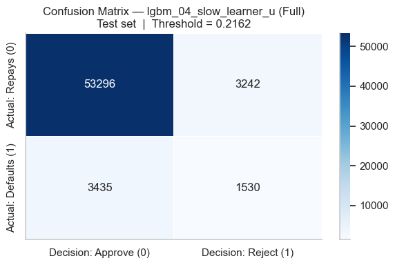
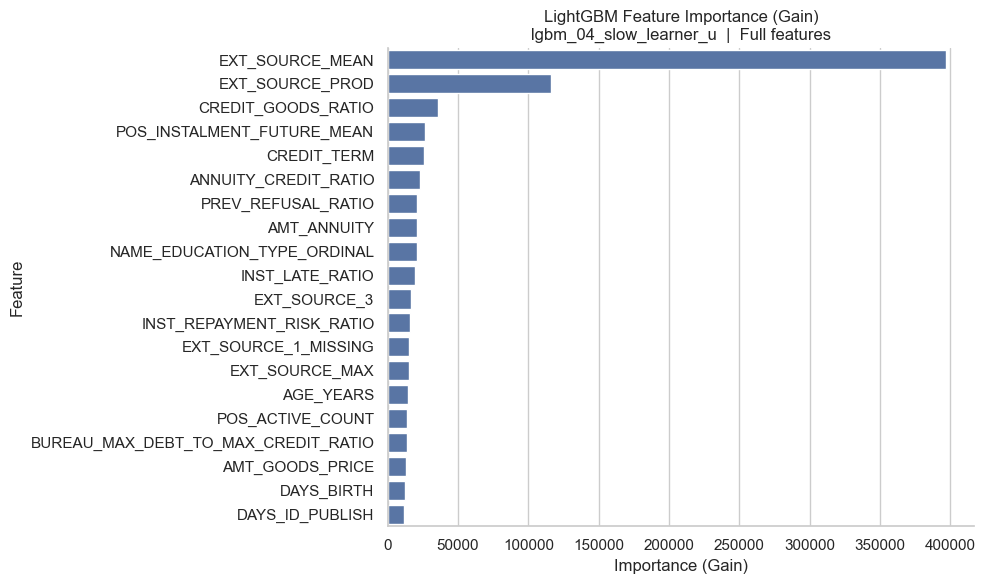

# Credit Risk Modelling & Payoff-Based Lending Decisions

**Tianjiao Jia · Independent project · Finance / FinTech**

An end-to-end credit-risk research project connecting machine-learning predictions with lending decisions and explicit financial trade-offs. I independently completed the data analysis, feature engineering, model comparison, and payoff evaluation.

**307,511 applications · 268 engineered modelling features · 0.7798 test ROC-AUC · 0.2733 test Average Precision**

[View the notebook](credit_risk_modelling.ipynb) · [Data requirements](DATA.md) · [Reproducibility notes](REPRODUCIBILITY.md)

## Business question

How can a lender identify applicants at higher risk of payment difficulty while balancing lending volume, foregone interest income, and potential credit losses?

The workflow estimates risk and converts predicted probabilities into approve/reject decisions under three illustrative payoff scenarios. It demonstrates financial decision analysis, rather than optimizing classification accuracy alone.

## What I built

- **Data preparation:** profiled 307,511 applications and 105 input columns; investigated missingness, sentinel values, skewed financial variables, and an approximately 8.07% positive-class rate.
- **Feature engineering:** constructed affordability and repayment-burden ratios, external-score summaries, and credit-history indicators; aligned categorical encodings across splits.
- **Model development:** compared logistic regression, L2-regularized logistic regression, Random Forest, XGBoost with Optuna, and LightGBM. Preprocessing statistics and feature selection were fitted on training data.
- **Decision evaluation:** assessed ROC-AUC, Average Precision, precision/recall, confusion matrices, lending approval rates, and simulated payoff under conservative, balanced, and growth-oriented assumptions.

**Stack:** Python, pandas, NumPy, scikit-learn, XGBoost, LightGBM, Optuna, Matplotlib, Seaborn, Jupyter.

## Workflow

```text
Application + aggregated credit-history data
  → exploratory analysis
  → stratified 60% / 20% / 20% train–validation–test split
  → training-based cleaning, feature engineering, and encoding
  → model comparison and validation-based configuration selection
  → train + validation refit of the selected LightGBM configuration
  → retrospective test evaluation and payoff-scenario analysis
```

The split contains **184,506 training**, **61,502 validation**, and **61,503 test** applications. The LightGBM comparison covers six configurations, two feature representations (Full / Top50), and weighted / unweighted variants: **24 candidate runs**.

## Recorded LightGBM results

These values come from the **original notebook's saved outputs**. The portfolio edition has not been retrained. The selected configuration is `lgbm_04_slow_learner_u`, using the Full feature representation without class weighting.

| Measure | Recorded test result |
|---|---:|
| ROC-AUC | **0.7798** |
| Average Precision, labelled “PR-AUC” in the original notebook | **0.2733** |
| Precision at the balanced threshold | 0.3206 |
| Recall at the balanced threshold | 0.3082 |
| Approval rate | 92.24% |
| Rejection rate | 7.76% |
| Decision threshold | 0.216216 |

Average Precision is calculated with `average_precision_score`; it is not the trapezoidal area under a precision–recall curve. The positive class represents recorded **payment difficulty**, referred to as “default” in the original analysis.



*Original saved figure: 1,530 payment-difficulty cases were rejected and 3,435 were approved at the balanced threshold. This makes the remaining risk visible alongside the ranking metrics.*

## Connecting risk scores to financial decisions

The balanced scenario assumes a representative loan amount of **600,000 monetary units**, a **two-year** term, **12% annual simple interest**, a **4% alternative annual return**, and **50% loss given default**. These are fixed research assumptions, not current market quotes.

| Decision | Borrower repays | Borrower has payment difficulty |
|---|---:|---:|
| Approve | +144,000 | −300,000 |
| Reject and use the alternative investment | +48,000 | +48,000 |

Approving is preferred when `144,000 × (1 − p) − 300,000 × p > 48,000`, giving `p < 0.216216`. The recorded average payoff is **111,753.57 illustrative units per applicant** under this simplified scenario. This is a simulated decision metric, not realized profit, revenue, or an investment return.



*Original saved gain-importance plot. Feature importance describes model usage; it does not establish causation or substitute for an applicant-level explanation.*

## Run locally

The repository can be reviewed without access to the data. To execute the analysis, supply your own authorized copy of the exact aggregated input described in [DATA.md](DATA.md).

```bash
python3 -m venv .venv
source .venv/bin/activate
python -m pip install -r requirements.txt
mkdir -p data
# Place your authorized lending_analytics.csv in data/.
jupyter lab credit_risk_modelling.ipynb
```

Use Python 3.11 or 3.12 as a starting environment. On Windows, activate the environment with `.venv\Scripts\activate`. Run the notebook from its repository directory, from top to bottom. XGBoost defaults to CPU in this portfolio edition; set `CREDIT_RISK_XGB_DEVICE=cuda` before launching Jupyter to use a compatible NVIDIA environment. Set `CREDIT_RISK_DATA_PATH` to use a different input location.

The full run includes mutual-information feature selection, 50 Optuna trials, and 24 LightGBM candidates, so runtime and memory use can be substantial. Dependency ranges are proposed compatibility constraints, not a verified environment lock. See [REPRODUCIBILITY.md](REPRODUCIBILITY.md) before rerunning.

## Interpretation and next steps

This is a retrospective academic research project. Initial target-aware EDA used the full dataset, and the original cross-model recommendation considered test results. It therefore does not establish an untouched prospective estimate of deployment performance. Preprocessing and feature-selection fitting use the training split, but that alone does not remove these broader evaluation limitations.

The main next steps are a fresh temporal or external holdout, probability-calibration checks, subgroup fairness assessment, and more realistic loan-level cash flows. Specific inherited implementation caveats are documented in [REPRODUCIBILITY.md](REPRODUCIBILITY.md). No production deployment or live lending outcomes are claimed.

## 中文简介

**个人独立完成的消费信贷风险建模与收益决策项目**。围绕约 30.75 万笔贷款申请，使用 Python 完成数据清洗、特征工程、机器学习模型比较与风险收益分析，将支付困难概率转换为不同风险偏好下的贷款审批决策。

原始 Notebook 保存的 LightGBM 测试集结果为 **ROC-AUC 0.7798、Average Precision 0.2733**。项目展示金融分析、信用风险、数据处理与机器学习能力；收益为假设场景模拟值。仓库保留分析代码和汇总结果，不包含原始申请人数据、个人信息或课程报告。
